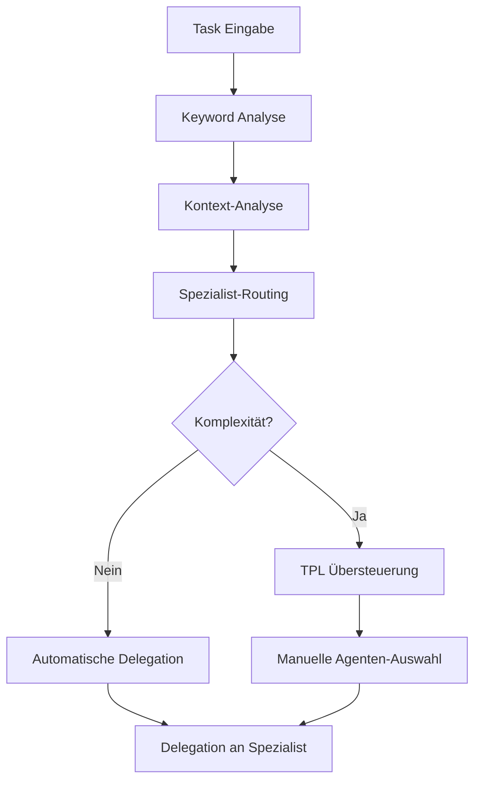

# Integrierte Delegations-Architektur (DELEGATION_ROTMT + AI_PROFESSIONS)

**Datum:** 8. November 2025  
**Status:** Design Phase  
**Autor:** Technischer Projektleiter (TPL)

---

## 🎯 ZIELSETZUNG

Zusammenführung der bewährten TPL-Delegationsmethodik mit der spezialisierten Agenten-Architektur zu einem hybriden, intelligenten System.

---

## 🏗️ ARCHITEKTUR-KOMPONENTEN

### **1. Hybride Agenten-Auswahl (Smart-Routing)**

#### **Automatische Agenten-Auswahl (Primary)**
```yaml
Routing-Logik:
  - Keywords analysieren → AI_PROFESSIONS Routing
  - Spezialisten priorisieren → Generalisten als Fallback
  - Kontext-basierte Verfeinerung
```

#### **Manuelle TPL-Übersteuerung (Secondary)**
```yaml
Eskalations-Protokoll:
  - TPL kann Agenten manuell wählen
  - Bei Mehrdeutigkeit oder komplexen Tasks
  - Spezialisten-Kombinationen möglich
```

### **2. Erweiterte Agenten-Hierarchie**

#### **Level 1: Spezialisten (AI_PROFESSIONS)**
```yaml
Primäre Spezialisten:
  - database_error_specialist
  - async_state_management_specialist  
  - data_parsing_validation_specialist
  - ui_error_handling_specialist
  - performance_error_specialist
  - debugging_error_specialist
  - testing_quality_specialist
  - mcp_integration_specialist

Domain-Spezialisten:
  - character_editor_specialist
  - quest_library_specialist
  - sound_audio_specialist
  - wiki_lore_keeper_specialist
  - campaign_manager_specialist
  - bestiary_monster_specialist
  - database_architect_specialist
  - ui_theme_specialist
```

#### **Level 2: Generalisten (TPL-System)**
```yaml
Fallback-Agenten:
  - frontend_agent (UI/Widgets)
  - backend_api_agent (Services/APIs)
  - database_agent (Schema/Queries)
  - generalist_agent (Dokumentation/Dateien)
```

### **3. Intelligente Task-Klassifizierung**

#### **Automatische Analyse**
```dart
class TaskClassifier {
  AgentSelection analyzeTask(TaskDescription task) {
    // 1. Keyword-Extraktion
    final keywords = extractKeywords(task.description);
    
    // 2. Kontext-Analyse (Dateien, Fehler, etc.)
    final context = analyzeContext(task.files);
    
    // 3. Primär-Spezialist bestimmen
    final primary = AI_PROFESSIONS.route(keywords + context);
    
    // 4. Komplexität bewerten
    if (isComplex(task)) {
      return AgentSelection(
        primary: primary,
        fallback: determineFallback(primary),
        requiresTPL: true
      );
    }
    
    return AgentSelection(primary: primary);
  }
}
```

---

## 🔄 WORKFLOW-INTEGRATION

### **Phase 1: Smart Task Analysis**


### **Phase 2: Enhanced Delegation Prompt**
```markdown
Du bist der `[automatisch_ergebener_Spezialist]`.

**Intelligent-Routing Ergebnis:**
- **Primär-Spezialist:** [Name]
- **Routing-Konfidenz:** [0-100%]
- **Alternative:** [Fallback-Agent]
- **TPL-Übersteuerung:** [Ja/Nein]

**Kontext-Laden:**
1. Lies `.vscode/docs/BUG_ARCHIVE.md` für Projekt-Wissen
2. Lies [spezialisten-spezifische Kontext-Dateien]
3. Lies [task-spezifische Dateien]

**Dein spezifischer Task:**
[Präzise Task-Beschreibung]

**Dein Protokoll (A-P-B-V-L):**
[Standard-Protokoll mit Enhanced Error-Handling]

**Intelligentes Eskalations-Protokoll:**
[Erweitertes Protokoll mit spezialisierten Escalation Paths]
```

---

## 🛠️ IMPLEMENTIERUNGSPLAN

### **Task 1: Smart Routing Engine**
```yaml
Datei: lib/services/task_routing_service.dart
Verantwortlich: backend_api_agent + debugging_error_specialist
Funktionalität:
  - Keyword-basierte Agenten-Auswahl
  - Kontext-Analyse
  - Komplexitäts-Bewertung
  - TPL-Integration
```

### **Task 2: Enhanced Prompt Generator**
```yaml
Datei: lib/services/delegation_prompt_service.dart
Verantwortlich: generalist_agent
Funktionalität:
  - Intelligente Prompt-Generierung
  - Spezialisten-spezifische Kontexte
  - Routing-Informationen integrieren
```

### **Task 3: TPL Dashboard Update**
```yaml
Datei: .vscode/PROJECT_TODO.md (Update)
Verantwortlich: TPL_specialist
Funktionalität:
  - Spezialisten-Status anzeigen
  - Routing-Konfidenz anzeigen
  - Manuelle Übersteuerung ermöglichen
```

### **Task 4: Agenten-Kompatibilitäts-Layer**
```yaml
Datei: .vscode/docs/roles/ (Updates)
Verantwortlich: generalist_agent
Funktionalität:
  - Alle Agenten auf Enhanced Prompt Schema updaten
  - Eskalations-Protokolle standardisieren
  - Cross-Spezialist-Kommunikation etablieren
```

---

## 📊 VORTEILE DER INTEGIERTEN ARCHITEKTUR

### **1. Best of Both Worlds**
- **Automatisierung:** Keyword-basiertes Routing für Geschwindigkeit
- **Flexibilität:** TPL-Übersteuerung für komplexe Fälle
- **Spezialisierung:** Zugriff auf 15+ Spezialisten
- **Robustheit:** Mehrere Eskalations-Paths

### **2. Skalierbarkeit**
```yaml
Erweiterbarkeit:
  - Neue Spezialisten leicht hinzufügbar
  - Routing-Regeln konfigurierbar
  - TPL-Protokoll bleibt stabil
```

### **3. Fehler-Reduktion**
```yaml
Qualität:
  - Spezialisten haben tieferes Wissen
  - Automatische Kontext-Analyse
  - Multi-Level Eskalation
```

---

## 🔧 KONFIGURATION

### **Routing-Regeln Erweiterung**
```yaml
# .vscode/docs/AI_PROFESSIONS.md (Erweiterung)
Enhanced Routing Rules:
  [Keywords: complex, multi-system, architecture]
  -> docs/roles/TPL_specialist.md (Force TPL)
  
  [Keywords: delegation, prompt, management]
  -> docs/roles/TPL_specialist.md (Force TPL)
  
  [Keywords: integration, system, architecture]
  -> docs/roles/generalist_agent.md (Primary)
  -> docs/roles/TPL_specialist.md (Secondary)
```

### **TPL-Enhanced Prompts**
```yaml
# DELEGATION_PLAN.md (Update)
Enhanced Template:
  - Routing-Analyse integrieren
  - Spezialisten-Kontexte laden
  - Multi-Agenten-Koordination
  - Intelligente Eskalation
```

---

## 🎯 NÄCHSTE SCHRITTE

### **Sofort (Phase 1)**
1. **Routing Service implementieren** - backend_api_agent
2. **Prompt Generator erweitern** - generalist_agent
3. **Agenten-Kompatibilität sicherstellen** - generalist_agent

### **Mittel (Phase 2)**
1. **TPL Dashboard anpassen** - TPL_specialist
2. **Eskalations-Protokolle testen** - debugging_error_specialist
3. **Performance optimieren** - performance_error_specialist

### **Langfristig (Phase 3)**
1. **Machine Learning Routing** (optional)
2. **Agenten-Performance Tracking**
3. **Automatische Qualitätssicherung**

---

## 📈 SUCCESS METRICS

### **Quantitativ**
```yaml
Messgrößen:
  - Delegation-Geschwindigkeit (Target: -50% Zeit)
  - First-Time-Resolution Rate (Target: +30%)
  - Eskalations-Rate (Target: -40%)
  - Agenten-Auslastung (Balanced)
```

### **Qualitativ**
```yaml
Indikatoren:
  - Bessere Spezialisierungs-Genauigkeit
  - Reduzierte TPL-Workload
  - Höhere Code-Qualität
  - Schnellere Problem-Lösung
```

---

## 🔄 MIGRATIONS-STRATEGIE

### **Kompatibilitäts-Modus**
- Alte TPL-Prompts bleiben funktionsfähig
- Schrittweise Migration der Agenten
- Parallele Betriebsfähigkeit

### **Rollout-Plan**
1. **Woche 1:** Core Engine implementieren
2. **Woche 2:** Spezialisten migrieren
3. **Woche 3:** TPL-Integration testen
4. **Woche 4:** Full-Production

---

**Architekt:** Technischer Projektleiter (TPL)  
**Version:** 1.0  
**Status:** Ready for Implementation
